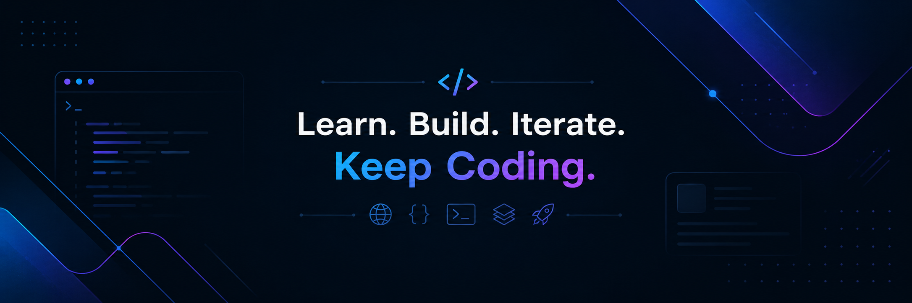

  

<h3 align="center">Full Stack Web Developer | Ruby on Rails Focused</h3>

---

## 🧠 Knowledge Areas

- **Programming Basics:** HTML, CSS, JavaScript, AJAX, API Fetch
- **Backend Development:** Ruby, Ruby on Rails
- **Full Stack Development:** Node.js, Express.js
- **Frontend Development:** JavaScript, React
- **Databases:** PostgreSQL, MongoDB
- **Styling:** Bootstrap, SCSS, Responsive Design
- **Rails Project Experience:** MVC, ActiveRecord, ERB Views, Active Storage, Devise, PaperTrail, Sidekiq, Redis
- **Testing & Code Quality:** RSpec, FactoryBot, SimpleCov, RuboCop
- **Tools & Deployment:** Git, GitHub, Heroku, Render
- **AI Tools:** ChatGPT

---

## 🛠️ Skills & Technologies

### Programming Basics

### Backend Development

### Frontend Development

### Databases

### Rails / OYE Project Tools

### Testing & Code Quality

### Tools & Deployment

---

## 📊 GitHub Languages

  

